Adapted from "EIM_HowTo2018" by Liora Llewellyn, based on work completed for the 2025 EIM upload of locations and data spanning from 2015 to 2025.

# Contents (contains section links)

{width="25"}[Accessing Data and Other Information]

[PSSB Results Data Download]

{width="25"}[Accessing Templates and Help Guides]

{width="25"}[Matching Locations Data to EIM Template (R code)]

[What locations are new since last upload?]

[Filling in locations data applicable to all sites]

[Filling in site-specific locations data]

[Final checks before location data upload]

{width="25"}[Matching Results Data to EIM Template (R code)]

[Managing duplicates among sample, taxon, and lifestage]

[Managing differences between taxonomy in PSSB and EIM]

[Adding Taxa to EIM]

[Replacing Taxon/TSN Values in PSSB Data]

[Filing in sample-specific data]

[Final checks before results data upload]

{width="25"}[Submitting Locations and Results to EIM]

# {width="30"}Accessing Data and Other Information

For our upload to EIM, you will likely need to download or access data from multiple sources:

-   [Puget Sound Stream Benthos](https://pugetsoundstreambenthos.org/)

-   [Environmental Information Management System Database](https://apps.ecology.wa.gov/eim/search/default.aspx)

-   [SiteMaster](https://kc1.sharepoint.com/teams/DNRP-ScienceTCAUnit-StreamTeam2021/Lists/sitemaster_list/AllItems.aspx?p=11)

-   [EIM Map Search](https://apps.ecology.wa.gov/eim/search/Map/Map.aspx?MapType=EIM)

-   [EIM Valid Values Lookup](https://apps.ecology.wa.gov/eim/help/ValidValues/Taxa)

-   [Integrated Taxonomic Information System](https://itis.gov/)

## PSSB Results Data Download

1)  Access Puget Sound Stream Benthos [here](https://pugetsoundstreambenthos.org/). In the top toolbar, navigate to "Analysis" and then "B-IBI Results Table". If available, select "Show More Options" in the top right section to of the query bar (Figure 1).

[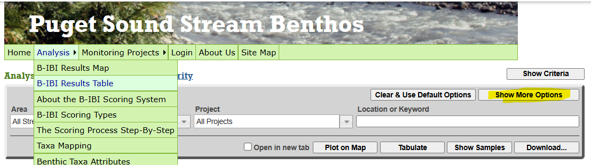](https://pugetsoundstreambenthos.org/Biotic-Integrity-Scores.aspx)

2)  Input the following criteria into the query bar (Figure 2):


-   Area: All Streams and Rivers

-   Project: Relevant King Country Project. *Note that in 2025, Ambient Monitoring and Miller-Walker data was uploaded together. Boise Ambient and Vashon data were not uploaded.*

    -   King-DNRP Ambient Monitoring

    -   King-DNRP: Boise Ambient

    -   King-DNRP: Vashon

    -   King-DNRP Miller-Walker

-   Aggregation: Don’t Aggregate

-   Score Type: 0 - 100 B-IBI

-   Metric: Overall Score

-   Replicate Handling: Combine replicates, then calculate

-   Taxonomic Resolution/STE: As Defined by Metadata

-   Taxa Attributes: Fore, Wisseman, 2012 (recommended for 0-100 B-IBI)

-   Number of Organisms: Count Per Visit

-   Min: blank, Max: blank, select "Flag"

-   Year: All in Range, from [starting year] to [ending year]

Then select "Download..."

3)  A pop-up should appear (Figure 3), prompting you to, "Specify Your Download". Under "Select Format", choose "Wash. DOE's EIM Format". **NOTE: The format within PSSB will likely not be current, so you will have to adjust the data after download to fit the most current [EIM Results Template](https://apps.ecology.wa.gov/eim/help/HelpDocuments).**

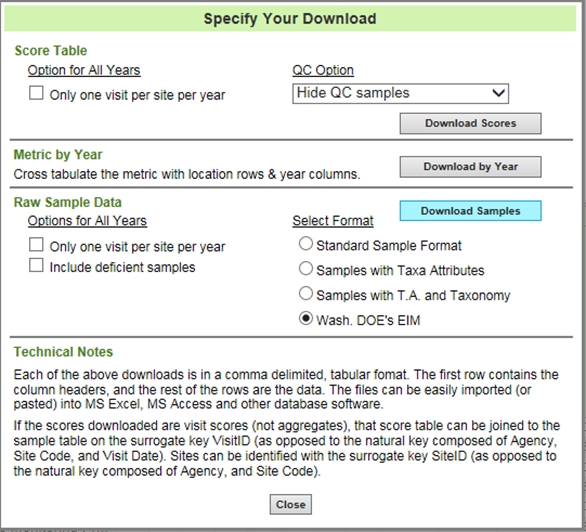{width="373"}

Data will be downloaded as a txt file, which can be opened within Excel and then saved as an Excel Spreadsheet or csv file.

4)  If downloading multiple years of data or data from multiple projects, you may need to combine them into one dataframe. This can easily be done in Excel or by using R using the rbind() function.

## Existing EIM Locations Data Download

1.  To reference which locations had previously been added to EIM and look at formatting for data, first navigate to the [EIM Search](https://apps.ecology.wa.gov/eim/search/) Page, then under "Search", select "ALL" (Figure 4).

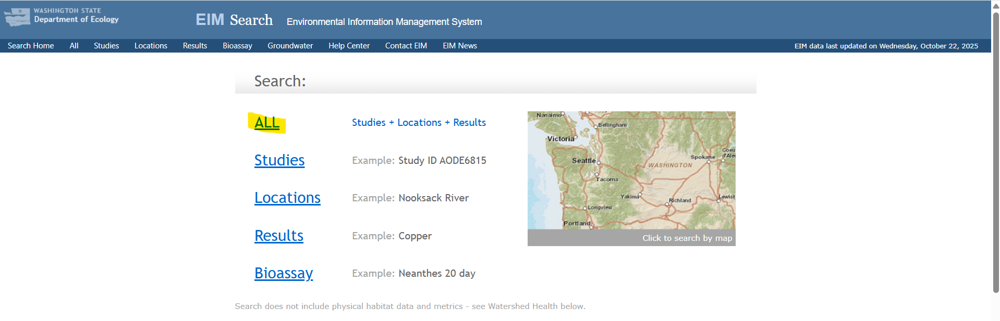

2.  On the next page, type, "Ambient Monitoring" into the search bar next to "Study ID", and select "Search Data" (Figure 5)

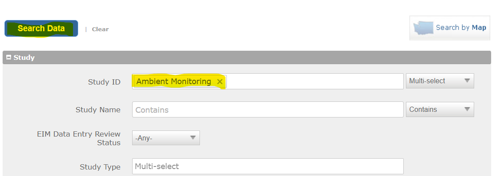

You should have search results containing one study, "Ambient Monitoring".

3.  Select the carrot mark left of the result "Study ID" and a drop-down menu should appear (Figure 6). Select "List of Locations".

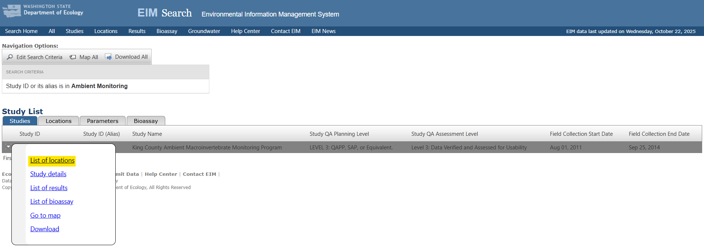

A list of all the locations within the Ambient Monitoring Study should appear (Figure 7). To view the details of a location within the list, select the carrot mark left of the result "Location ID" and select "Location Details" in the drop-down menu.

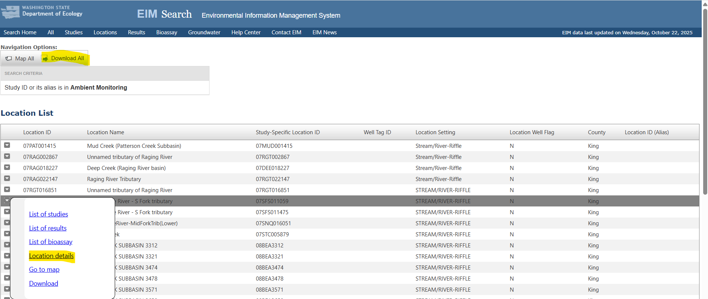

4.  Select "Download All" at the top of the page. From here, you will be navigated to a page to download data (Figure 7). Enter in an email address to send the data to, and **deselect discrete results** (leaving this selected will give you all of the actual B-IBI scores, which you do not need). (Figure 8)

Select "Queue Download" at the bottom of the form. This will send a confirmation email and an email containing a hyperlink download to the provided email address.

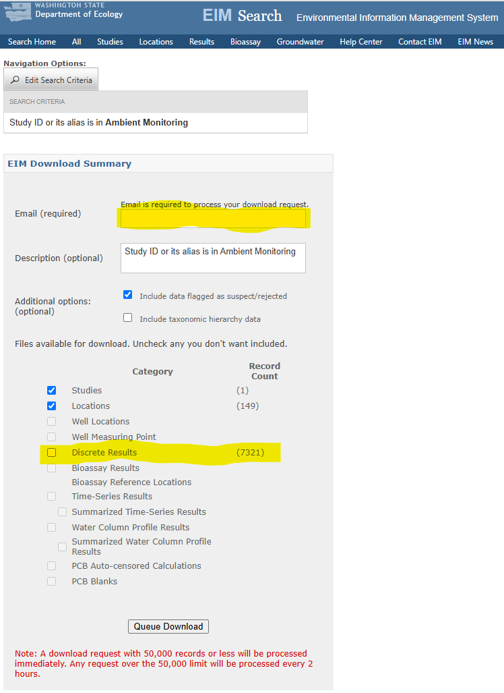{width="366"}

## Location Data from PSSB and SiteMaster Download

Information such as the lat/long of the site and a location description can be found from PSSB and SiteMaster. *You may not need both sources for future uploads - only SiteMaster.*

1.  To download from PSSB, follow the same steps as in [PSSB Results Data Download], but under, "Year", select "Latest per Site in Range" (Figure 9). Then, in the "Specify Your Download" pop-up, select "Standard Sample Format" (Figure 10).

Ideally, you want to download results with only one entry per site, as we just want information about the site itself. In 2025, we downloaded site info from PSSB and saved it as PSSB_LocationInfo.csv.

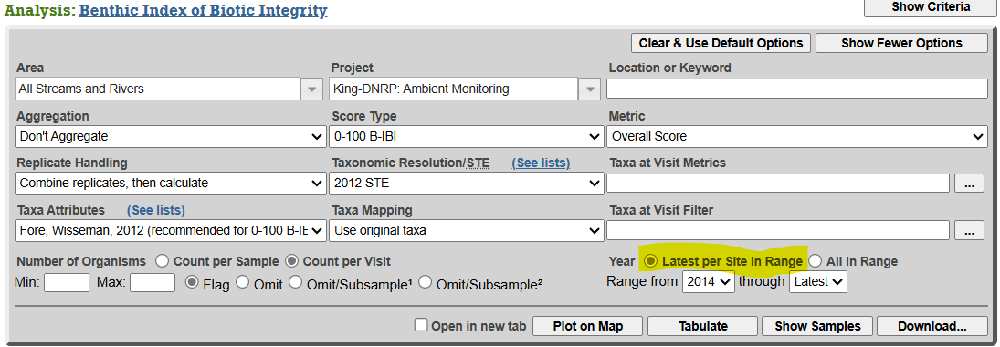

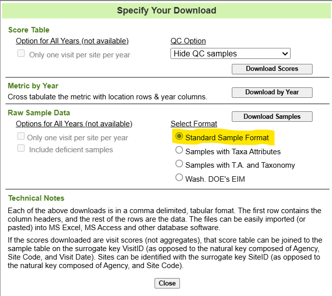{width="328"}

2.  To download data from [SiteMaster](https://kc1.sharepoint.com/teams/DNRP-ScienceTCAUnit-StreamTeam2021/Lists/sitemaster_list/AllItems.aspx?p=11), first make sure no filters are selected. Then in the top toolbar, select "Export" and the desired data formatting from the drop-down menu (Figure 11).

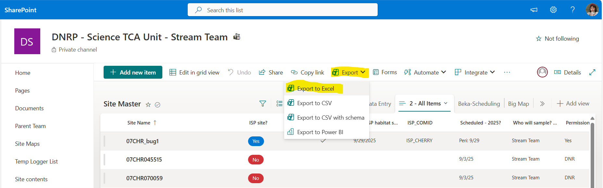

## Valid EIM Values Download

# {width="30"}Accessing Templates and Help Guides

Results and Location data will need to be formatted according to the EIM templates. The templates, help guides, and searches for valid values can be accessed from the [Environmental Information Management (EIM) Help Center page](https://apps.ecology.wa.gov/eim/help/HelpDocuments).

Reference the most recent templates and help guides frequently while preparing data for upload!

# {width="30"}Matching Locations Data to EIM Template (R code)

What you will need:

-   [PSSB Results Data Download]

-   [The most current EIM Locations Template](https://apps.ecology.wa.gov/eim/help/HelpDocuments) (See [Accessing Templates and Help Guides])

-   [Existing EIM Locations Data Download]

-   [Location Data from PSSB and SiteMaster Download]

## What locations are new since last upload?

To see what locations have been added since the last upload, we can filter out the locations listed in the PSSB data ("PSSBDownload_2015-2025.csv") by the locations already listed within EIM data ("EIM_ExistingLocations_Download/EIMLocationDetails_2025Aug12_149.csv)

Run the below code to generate a list of newly added sites (changing file names to match when applicable):

```{r results = FALSE, warning=FALSE}
#Load in packages
library(tidyr)
library(dplyr)

#Data from PSSB added since last EIM upload
PSSB <- read.csv("DataInputs/PSSBDownload_2015-2025.csv") 
  #Just checking the column headers
  head(PSSB)

##Just the location information already in EIM
EIM_2014 <- read.csv("DataInputs/EIMLocationDetails_2025Aug12_149.csv") 
  #Just checking the column headers
  head(EIM_2014)

#Assigning the locations to a variable for each dataset
PSSB_Locations <- PSSB$Study_Specific_Location_ID
  PSSB_Locations <- unique(PSSB_Locations) #Filtering out the list to get only one entry of each site location

EIM_Locations <- unique(EIM_2014$Location_ID)

#Seeing what locations are in the PSSB data (list a) but not in the EIM data (list b)
#This list of should be used to fill out a location form, telling EIM what sites we've added since last upload
added_locations <-setdiff(PSSB_Locations,EIM_Locations)
```

## Filling in locations data applicable to all sites

Following the previous section, we can then load our EIM Locations Template into R, add in the IDs of the new locations, and then information that is applicable to all sites ([as guided by the EIM Location Help Guide](https://apps.ecology.wa.gov/eim/help/HelpDocuments)). *Below is information most current for the 2025 upload :*

```{r, results = FALSE, warning=FALSE}
#Loading in our location template
location_template <- read.csv("BlankTemplates/EIMLocationTemplate.csv")
  #Just checking the column headers
  head(location_template)
  #Adding in rows of NA values to dataset the length of the number of new sites
  #This will allow us to add in data to each column from various sources
  location_template[1:length(added_locations),] <- ""

  #Let's fill out the template!
  
  #Adding in the location_ids
  location_template$Location_ID <- added_locations
  
    #Removing incorrect data entry
    location_template <- location_template[-41,]
  
  #Adding in the location setting
  location_template$Location_Setting <-"Stream/River-Riffle"

  #Is location a well
  location_template$Is_Location_A_Well <-"N"
  
  #State
  location_template$State <- "WA"
  
  #Coordinate System
  location_template$Coordinate_System <- "LAT/LONG"
  
  #Horizontal Coordinates Represent
  location_template$Horizontal_Coordinates_Represent <- 26 #26 for a Stream/Segment according to EIM Help Document
  
  #Horizontal Datum
  location_template$Horizontal_Datum <- 3 #3 for NAD 1983 HARN according to EIM Help Document
  
  #Horizontal Coordinate Accuracy
  location_template$Horizontal_Coordinate_Accuracy <- 5 #Estimate based on iPhone 14 GPS accuracy, +- 20 ft
  
  #Horizontal Coordinate Collection Method
  location_template$Horizontal_Coordinate_Collection_Method <- 16 #Based on EIM guidebook, "consumer unit"
```

## Filling in site-specific locations data

The template may require information such as the location name (based on the river), location description, latitude, and longitude - which differ between each site.

As such, we are taking whatever information is already in PSSB or SiteMaster to help fill out these columns.

*Note 1: For 2025, we used both PSSB and SiteMaster data to fill out this information due to some sites being retired - this may not be necessary for future uploads.*

*Note 2: The location description will need to be updated manually later in Excel to be shorter and note if site is behind private property.*

**Immediately save the written csv as .xlsx for editing! This will prevent data from being truncated or reformatted, and will allow you to save edits.**

```{r, results = FALSE, warning=FALSE}
#Loading in other information from PSSB and Site Master
  PSSB_loc2 <- read.csv("DataInputs/PSSB_LocationInfo.csv")
  SiteMaster <- read.csv("DataInputs/SiteMaster_NewSites.csv")
  
  #Merging our PSSB and SiteMaster location information together into one dataframe
  PSSB_loc2 <-rename(PSSB_loc2, Location_ID = Site.Code)
  SiteMaster <-rename(SiteMaster, Location_ID = Site.Name)
  location_template <- merge.data.frame(location_template, PSSB_loc2, by = "Location_ID", all.x = TRUE)
  location_template <- merge.data.frame(location_template, SiteMaster, by = "Location_ID", all.x = TRUE)
  
#Copying over data from the added columns to the template columns (since they should now be in the same order)
  location_template$Location_Name <- location_template$Stream.or.River
  location_template$Location_Description <- location_template$Navigate.to
  location_template$Latitude_Decimal_Degrees <- location_template$Lat
  location_template$Longitude_Decimal_Degrees <- location_template$Long
  
  #Deleting superfluous columns - adjust according to your data!
  location_template <- location_template[,-(66:115)]
  
  #Exporting as a .csv
  write.csv(location_template, "locationtemplate_edit.csv")
```

### Finding NHD Reach Codes for each site

Each site will require a National Hydrography Reach (NHD) Code, which can be found by manually using the [EIM Map Search](https://apps.ecology.wa.gov/eim/search/Map/Map.aspx?MapType=EIM).

The easiest way to find the NHD Reach Code is to select the "Find" tab, and then search using the given latitude and longitude of the site (Figure 12).

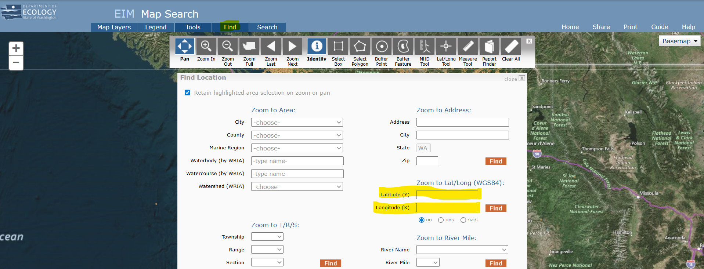

Once you search by lat/long, a yellow cross-hair will appear on the map (Figure 13). Select the "NHD Tool" and blue outlines for the nearest streams/rivers will appear. To find the reach code, click on the map at the closest point along the stream to the yellow cross-hair. A yellow dot will appear, and a pop-up will generate with the Reach Code.

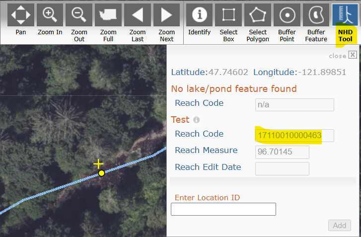{width="549"}

## Final checks before location data upload

While making final edits in Excel, check that each column is the correct [data type](https://support.microsoft.com/en-us/office/data-types-in-data-models-e2388f62-6122-4e2b-bcad-053e3da9ba90) and follows the conventions as designated by the [help document](https://apps.ecology.wa.gov/eim/help/HelpDocuments) prior to upload.

# {width="30"}Matching Results Data to EIM Template (R code)

What you need:

-   [PSSB Results Data Download]

-   [Valid EIM Values Download]

-   [EIM Results Data Template](https://apps.ecology.wa.gov/eim/help/HelpDocuments) (see [Accessing Templates and Help Guides])

## Managing duplicates among sample, taxon, and lifestage

Because PSSB data updates with changes in macroinvertebrate taxonomy without compiling or altering counts, it is possible that the data may have duplicate entries per sample for a given taxon and lifestage.

So, we need to identify possible duplicates in our data and decide how to manage them. This code identifies duplicates and writes the out to a csv for review:

```{r, results = FALSE, warning=FALSE}
#Loading packages
library(tidyverse)

#Reading in our data
data <-read.csv("DataInputs/PSSBDownload_2015-2025.csv")

#Looking at the structure of our data
str(data)

#Subsetting data to only look at duplicates among site, taxon, and lifestage
data_sub <- data[,c("Sample_ID","Result_Taxon_Name","Result_Taxon_Life_Stage")]

#Which data entries are duplicates? *Only pulls out the second occurrence of the same data
dupes<-data_sub[which(duplicated(data_sub)),]

#filtering data in the big dataset that matches our duplicates
filtered_df <- semi_join(x = data, y = dupes)

#Writing to a .csv to assess
write.csv(filtered_df, file = "duplicates_PSSB2015-2025.csv")
```

### Combining Duplicates

For 2025, we decided that the duplicate values shouldn't impact the BIBI score. Thus, we decided to combine the counts for the duplicates:

```{r, results = FALSE, warning=FALSE}
#Combining the counts of all entries based on the same criteria we used to determine the duplicates

#Pulling out all of the info associated with each unique combo of sample id, life stage, and taxa (except for the counts!)
metadata <- data %>%
  distinct(Sample_ID, Result_Taxon_Name, Result_Taxon_Life_Stage, .keep_all = TRUE) %>%
  select(-Result_Value)

#Adding together the counts for all entries with the same unique combo, then joining the other columns back in
newcounts <- summarize(
  data,
  Result_Value = sum(Result_Value),
  .by = c(Sample_ID, Result_Taxon_Name, Result_Taxon_Life_Stage)
) %>%
  left_join(metadata, by = c("Sample_ID", "Result_Taxon_Name", "Result_Taxon_Life_Stage"))

#Removing duplicates based on the previous criteria, keeping all of the columns
#Not necessary, but a good final check
final_df <- distinct(newcounts, Sample_ID, Result_Taxon_Name, Result_Taxon_Life_Stage, .keep_all = TRUE)

#Saving data to new .csv
write.csv(final_df, file = "EIM_data_2015-2025.csv")
```

## Managing differences between taxonomy in PSSB and EIM

At time of data download, it is also possible that PSSB or EIM is not up to date with taxonomic statuses - resulting in Taxa Names or Taxonomic Serial Numbers (TSNs) that are incongruent between the databases.

The easiest way to check is by comparing the list of [EIM Valid Values](https://apps.ecology.wa.gov/eim/help/ValidValues/Taxa) to the Taxon Name and TSNs in PSSB data.

The code below writes out 2 csvs, one for "Result_Taxon_TSN" and one for "Result_Taxon_Name". This will take any values that don't 100% align with the allowed values in EIM for manual review.

**Save the csv as Excel files for easy editing!**

```{r, results = FALSE, warning=FALSE}
#Reading in our data
EIMdata <- read.csv("DataInputs/EIM_data_2015-2025.csv")

#Checking that result taxon tsn align with accepted EIM values
taxon <- read.csv("DataInputs/Taxon.csv")

tsn_diff <- setdiff(EIMdata$Result_Taxon_TSN, taxon$Taxonomic.Serial.Number..TSN.) 

#Are there Elements in EIMdata but not taxon
  diff_tsn_df <- EIMdata %>%
  filter(Result_Taxon_TSN %in% tsn_diff)

write.csv(diff_tsn_df, file = "diff_tsn_df.csv")
  
#Checking that result taxon name align with accepted EIM values
taxon <- read.csv("DataInputs/Taxon.csv")

taxon_name_diff <- setdiff(EIMdata$Result_Taxon_Name, taxon$Taxon.Name) #Are there Elements in EIMdata but not taxon

diff_name_df <- EIMdata %>%
                  filter(Result_Taxon_Name %in% taxon_name_diff)
  
write.csv(diff_name_df, file = "diff_name_df.csv")
```

After you have your list of flagged taxon, check each TSN/name within the [EIM Valid Values Search](https://apps.ecology.wa.gov/eim/help/ValidValues/Taxa).

Most entries on the list will have minor differences, such as capitalization. For example, taxa with a TSN of "0" within PSSB often have a valid Parent TSN within EIM. **DO NOT "roll-up" taxa to a more coarse identification.**

Likewise, it's possible for PSSB to use the less common or outdated synonym for some taxa, so cross-reference the species name or taxon with the [Integrated Taxonomic Information System](https://itis.gov/).

For entries that have a clear 1 to 1 replacement, place them into a table formatted like the one below to easily replace them in R:

| Old TSN | Old Name                         | New TSN | New Name                         |
|---------|----------------------------------|---------|----------------------------------|
| 0       | Paraleptophlebia Bicornuta Group | 101206  | Paraleptophlebia Bicornuta Group |
| 0       | Tricyphona                       | 121118  | Pedicia                          |
| 0       | Afghanurus                       | 100504  | Afghanurus                       |

: Replacement Values Table

### Adding Taxa to EIM

If you need to add Taxa to EIM, contact your EIM Data Coordinator with the name of each taxon and TSN as listed within PSSB.

### Replacing Taxon/TSN Values in PSSB Data

*See [Managing differences between taxonomy in PSSB and EIM] for table formatting*

The code below can be run to easily replace values in the results data:

```{r, results = FALSE, warning=FALSE}
#Replacing Incorrect Values
replacement <- read.csv("DataInputs/Replacement_Values.csv")

EIMdata_updated <- EIMdata %>%
  left_join(replacement, by = c("Result_Taxon_TSN" = "Old_TSN", "Result_Taxon_Name" = "Old_Name")) %>%
  mutate(
    Result_Taxon_TSN = if_else(!is.na(New_TSN), New_TSN, Result_Taxon_TSN),
    Result_Taxon_Name = if_else(!is.na(New_Name), New_Name, Result_Taxon_Name)
  ) %>%
  select(-New_TSN, -New_Name)  # Removing extra columns

#Exporting
write.csv(EIMdata_updated, file = "EIMData_R_Edit.csv")
```

## Final checks before results data upload

For our 2025 upload, we needed to fix some miscellaneous things (such as the analysis date) before uploading (as done in the R code below).

```{r, results = FALSE, warning=FALSE}
#Reading in our data
EIMdata <- read.csv("DataInputs/EIM_data_2015-2025.csv")

#Looking at the data
str(EIMdata)

#Removing extra column
EIMdata <- EIMdata[,-1]

#Replacing NA values with ""
EIMdata[is.na(EIMdata)] <- ""

#Making variables numeric
EIMdata$Result_Reporting_Limit <- as.numeric(EIMdata$Result_Reporting_Limit)
EIMdata$Result_Detection_Limit <- as.numeric(EIMdata$Result_Detection_Limit)

#Making dates in the right format
EIMdata$Field_Collection_Start_Date <- mdy(EIMdata$Field_Collection_Start_Date)
EIMdata$Field_Collection_Start_Date <- format(EIMdata$Field_Collection_Start_Date, "%m-%d-%Y")

#Checking the Lab Analysis Date
unique(EIMdata$Lab_Analysis_Date)
#For some reason, the dates are not correct, so I need to change them

  EIMdata<- EIMdata[, -39] #Removing the analysis date column

  #Data from PSSB to fix the lab analysis dates
  date1 <- read.csv("DataInputs/Date_Fix_pt1.csv")
  date1 <- date1[, c("Sample_ID", "Lab_Analysis_Date")] #I only need the dates
  date2 <- read.csv("DataInputs/Date_Fix_pt2.csv")
  date2 <- date2[, c("Sample_ID", "Lab_Analysis_Date")]

  dates <- distinct(rbind(date1, date2))

  EIMdata <- left_join(x = EIMdata, y = dates, by = "Sample_ID")
```

After working with the data in R, write it to a csv. **Immediately save the written csv as .xlsx for editing! This will prevent data from being truncated or reformatted, and will allow you to save edits.**

While making final edits in Excel, check that each column is the correct [data type](https://support.microsoft.com/en-us/office/data-types-in-data-models-e2388f62-6122-4e2b-bcad-053e3da9ba90) and follows the conventions as designated by the [help document](https://apps.ecology.wa.gov/eim/help/HelpDocuments) prior to upload.

# {width="25"}Submitting Locations and Results to EIM

To submit data to EIM, you will need a log-in to SecureAccess Washington and then a log-in to the EIM Loader.

Information to sign-up can be found [here](https://ecology.wa.gov/research-data/data-resources/environmental-information-management-database/eim-submit-data), but there should be an existing employee log-in you can use.

Steps to upload to EIM can be found on the [WA State Ecology Page](https://ecology.wa.gov/research-data/data-resources/environmental-information-management-database/eim-submit-data) or on the [Front Page of the EIM Loader](https://secureaccess.wa.gov/ecy/eimloader/Home.aspx).
